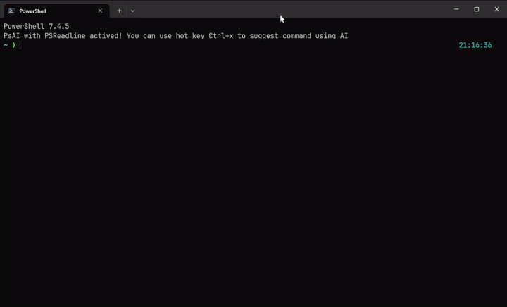

<h1 align="center">PsAI</h1>

<p align="center">
  A User-Friendly Module for PowerShell command suggestion using AI.
</p>

<p align="center">
  <a target="_blank" href="https://www.youtube.com/watch?v=vpAhpGeIIFs">
    
  </a>
</p>

## Todo
- [x] Support OpenAPI
- [x] Dynamic config
- [x] Better config initialization
- [x] Add Gemini support
- [ ] Use last error to enrich the suggestion
- [ ] Publish-Module


## How do I install it?

Clone from source:
```
git clone https://github.com/vnzinki/psai.git (Join-Path -Path ($Env:PSModulePath -split ';' | Where-Object { $_ -like "$HOME*" }) -ChildPath "PsAI")
```

Then auto Import Module by add line to your profile:
```
Add-Content -Path $PROFILE -Value 'if (Get-Module -Name PsAI -ListAvailable) { Import-Module PsAI }'

```

## How do I use it?
To use PsAI, simply type a description of what you want to do, and then press the hot key `ctrl+x`. PsAI will then fill the console with the command to accomplish what you described.
<br/>
<br/>
If you dont have PSReadLine installed, you can also use `PsAI` to get the command suggestion. Try it yourself:
```
PsAI "run docker postgresql on port 27001 with data from ./storage folder"
```

## Config

Config file is stored in `$env:USERPROFILE\.psai`
When you first run PsAI, it will prompt you to create a config file.

```
{
  "Provider": "OpenAI", # TODO: Add support for Gemini
  "OpenAI": {
    "BaseUrl": "https://api.groq.com/openai/v1" # Or https://api.openai.com/v1
    "Model": "llama3-groq-8b-8192-tool-use-preview",
    "ApiKey": "YOUR_API_KEY",
  }
}

```

Using your OpenAI API key from https://platform.openai.com/api-keys <br/>
Or you can get a free alternative from https://console.groq.com/keys like the example

## Troubleshooting
